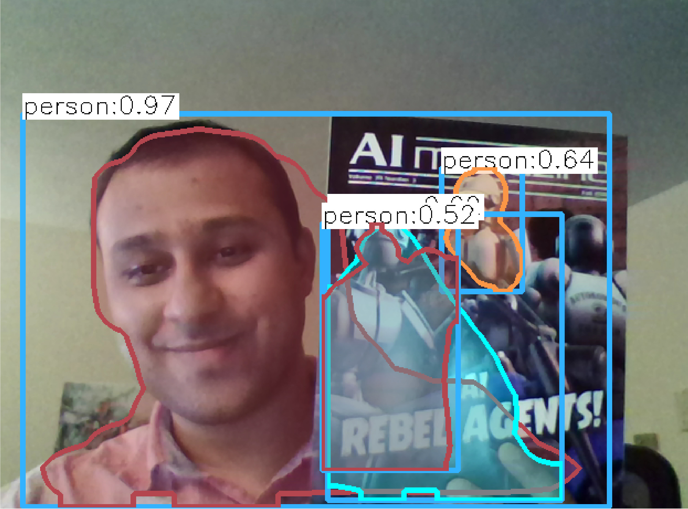

# Image-Instance-Segmentation
Segmentation and classification of multiple visual objects in an image or video frame. Preliminary results based on Mask R-CNN built with Inception V2 as classification foundation. Trained on class labels from the MSCOCO dataset. Subsequently, the fidelity of the silhouette and the visual object will be progressively improved using GAN a based approach to accurately eliminate any background clutter in the extracted object mask.

The Inception V2 pre-trained model checkpoint is: January 28 2018
Link to the model:
http://download.tensorflow.org/models/object_detection/mask_rcnn_inception_v2_coco_2018_01_28.tar.gz

Update the model file "frozen_inference_graph.pb" from the latest checkpoint when using this code. (Ensure the model file can be found. Modify the path in code to reflect any changes in path to this file.)

Details on Mask RCNN:
https://modelzoo.co/model/mask-r-cnn-keras
Based on this awesome blog on opencv:
https://www.learnopencv.com/deep-learning-based-object-detection-and-instance-segmentation-using-mask-r-cnn-in-opencv-python-c/

## Requirements
This code uses opencv library https://opencv.org/
Install opencv for python: $pip install opencv-contrib-python

We are using the DNN module within opencv to utilize the pre-trained InceptionV2 model, so this code does not depend on Tensorflow.

## Usage
At the command prompt:

$python image_instance_segmentation.py
(Running without arguments assumes the input device is webcam on the local machine)

$python image_instance_segmentation.py --image <path-to-image-file>
  
$python image_instance_segmentation.py --video <path-to-video-file>

